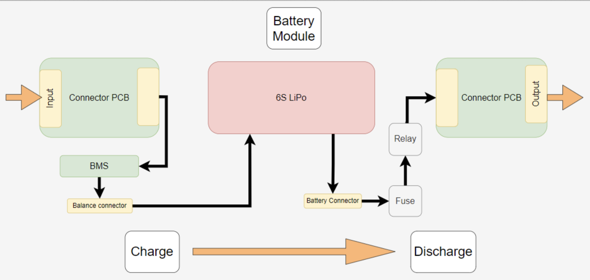

<h1>Schematics</h1>

This page provides a high-level overview of the electronics of the system. Block diagrams for each main system (battery modules, hub, and rover) are provided. three custom PCBs were crated for the function of the system: a rover PCB, a connector PCB, and a power swap PCB. The full design files for these boards is available in KiCad and Altium file formats at [this link](https://github.com/RIVeR-Lab/BOOST/tree/main/electrical/Minibot_V2).

<h2>Battery Module Electronics</h2>

  <figure>
      
    <figcaption>The battery module is the unit that is exchanged between the minibot and hubbot. The battery module consists of a 6S lipo battery, BMS, custom connector PCBs, as well as protection circuitry. The battery module housing is 3D printed and has design elements for proper alignment and exchange. 
    </figcaption>
  </figure>

<h2>Hub Electronics</h2>

  <figure>
      
    <figcaption>The hub consists of electronic components for sensing the states of battery modules and circuitry for recharging the 3x battery modules.
    </figcaption>
  </figure>

<h2>Rover Electronics</h2>

  <figure>
      
    <figcaption>A simplified block diagram of Rover's electronics.
    </figcaption>
  </figure>

