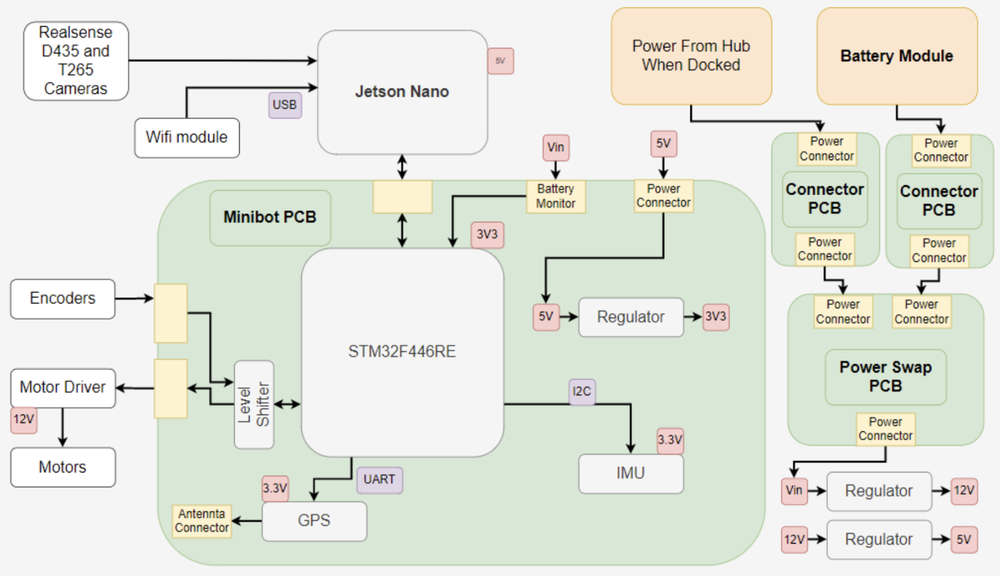

This is currently being updated. Here are some introductory schematics with a description of each component. 

    <h1>Battery Modules</h1>

  <figure>
      
    <figcaption>The battery module is the unit that is exchanged between the minibot and hubbot. The battery module consists of a 6S lipo battery, BMS, custom connector PCBs, as well as protection circuitry. The battery module housing is 3D printed and has design elements for proper alignment and exchange. Figure 9 details the system.
    </figcaption>
  </figure>

<h2>Hub Electronics</h2>

  <figure>
      
    <figcaption>The hub consists of electronic components for sensing the states of battery modules and circuitry for recharging the 3x battery modules.
    </figcaption>
  </figure>

<h2>Rover Electronics</h2>

  <figure>
      
    <figcaption>A simplified block diagram of Rover's electronics.
    </figcaption>
  </figure>

