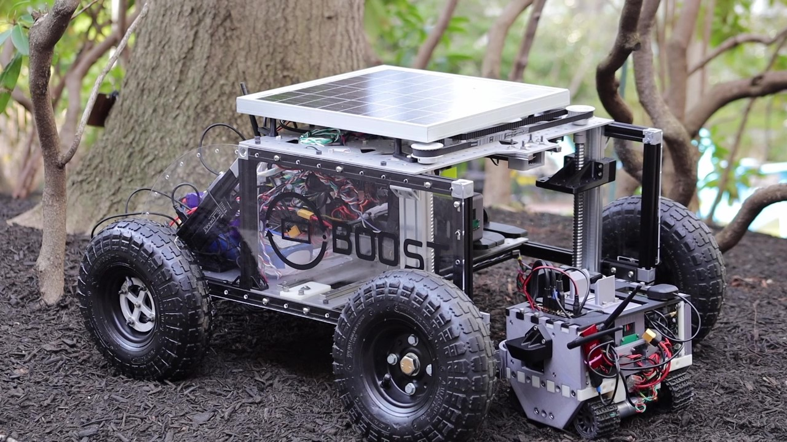

<html lang="en-US">
<head>
  <meta charset="UTF-8">
  <meta name="viewpoint" content="width=device-width, initial-scale=1.0">
  <!--<link rel="stylesheet" href="style.css"> -->
  <title>Battery-Swapping Multi-Agent System for Sustained Operation of Large Planetary Fleets</title>
</head>
<body>
  <div class="header-adder">
    <div class="title_set">
      <h1>Battery-Swapping Multi-Agent System for Sustained Operation of Large Planetary Fleets</h1>
    </div>
    <div class="names">
      <p><strong> <a href = https://ethanholand.com/">Ethan Holand</a> <sup>†</sup>, <a href =https://www.jarrod-homer.com/>Jarrod Homer</a>, Alex Storrer, Musheera Khandaker, Ethan F. Muhlon, Maulik Patel Ben-oni Vainqueur, David Antaki, Naomi Cooke, Chloe Wilson, Bahram Shafai, <a  href="https://nhanson.io/"  >Nathaniel Hanson</a>, <a  href="https://www.tpadir.info/">Taşkın Padır</a></strong></p>
  </div>

  <div>
    <div style="position:relative;padding-top:56.25%;">
      <iframe src="https://www.youtube.com/embed/pb5BIy4iOmw?si=D0DkIgj3zFI2LxPv"  title="YouTube video player" frameborder="0" allow="accelerometer; autoplay; clipboard-write; encrypted-media; gyroscope; picture-in-picture" allowfullscreen style="position:absolute;top:0;left:0;width:100%;height:100%;"></iframe>
    </div>
  </div>

  </div>
  <h2>Abstract</h2>
  <p>We propose a novel, heterogeneous multi-agent architecture that miniaturizes rovers by outsourcing power generation to a central hub. By delegating power generation and distribution functions to this hub, the size, weight, power, and cost (SWAP-C) per rover are reduced, enabling efficient fleet scaling. As these rovers conduct mission tasks around the terrain, the hub charges an array of replacement battery modules. When a rover requires charging, it returns to the hub to initiate an autonomous docking sequence and exits with a fully charged battery. This confers an advantage over direct charging methods, such as wireless or wired charging, by replenishing a rover in minutes as opposed to hours, increasing net rover uptime.</p>
  <p>This work shares an open-source platform developed to demonstrate battery swapping on unknown field terrain. We detail our design methodologies utilized for increasing system reliability, with a focus on optimization, robust mechanical design, and verification. Optimization of the system is discussed, including the design of passive guide rails through simulation-based optimization methods which increase the valid docking configuration space by 258%. The full system was evaluated during integrated testing, where an average servicing time of 98 seconds was achieved on surfaces with a gradient up to 10°. We conclude by briefly proposing flight considerations for advancing the system toward a space-ready design. In sum, this prototype represents a proof of concept for autonomous docking and battery transfer on field terrain, advancing its Technology Readiness Level (TRL) from 1 to 3.</p>

<div style="text-align: center;">
  <figure>
      
    <figcaption>Field Testing of the prototype battery-swapping multi-agent rover architecture.
    </figcaption>
  </figure>
</div>

<h2>Publication Details</h2>
<p>We are excited to share that our paper was accepted to the <a href="https://www.aeroconf.org/" >2024 IEEE Aerospace Conference (Aeroconf)</a>. We presented our work on March 7th, 2024. A pre-print of the paper is available on <a href="https://arxiv.org/abs/2401.08497">arXiv</a>; the paper is officially available on <a href="https://ieeexplore.ieee.org/abstract/document/10521295">IEEEXplore</a>.</p>

### Citing

#### Plaintext: 

```
E. Holand et al., "Battery-Swapping Multi-Agent System for Sustained Operation of Large Planetary Fleets," 2024 IEEE Aerospace Conference, Big Sky, MT, USA, 2024, pp. 1-15, doi: 10.1109/AERO58975.2024.10521295.
```

#### Bibtex:

```
@INPROCEEDINGS{10521295,
  author={Holand, Ethan and Homer, Jarrod and Storrer, Alex and Khandeker, Musheeera and Muhlon, Ethan F. and Patel, Maulik and Vainqueur, Ben-oni and Antaki, David and Cooke, Naomi and Wilson, Chloe and Shafai, Bahram and Hanson, Nathaniel and Padır, Taşkın},
  booktitle={2024 IEEE Aerospace Conference}, 
  title={Battery-Swapping Multi-Agent System for Sustained Operation of Large Planetary Fleets}, 
  year={2024},
  volume={},
  number={},
  pages={1-15},
  keywords={Wireless communication;Rails;Prototypes;Optimization methods;Batteries;Outsourcing;Reliability},
  doi={10.1109/AERO58975.2024.10521295}}

```


</body>
</html>
<p><i>† Corresponding author. Email: holand.e@northeastern.edu</i></p>
